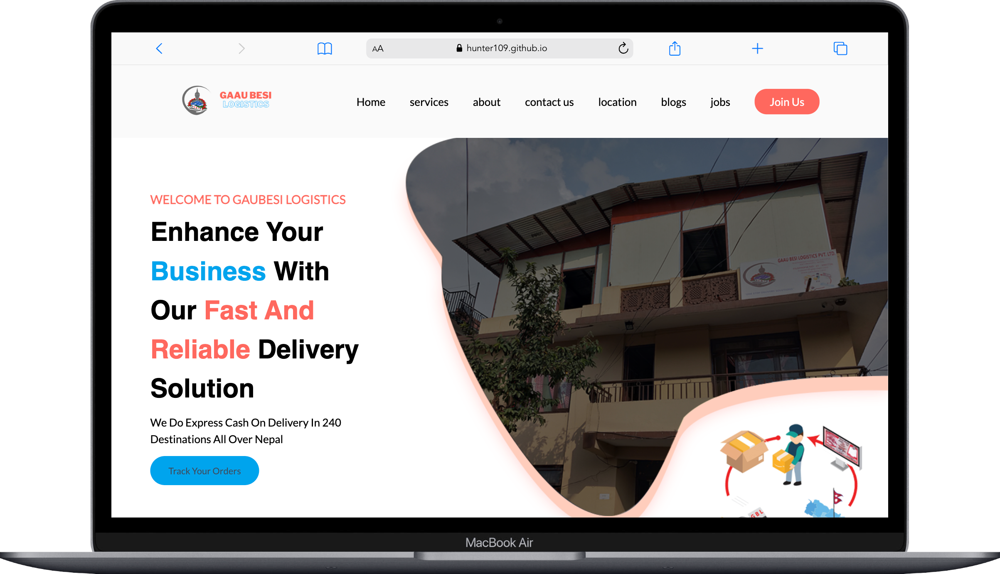

# Gaaubesi Logistics - Delivery All over Nepal


This is a clone of the Gaaubesi Logistics - Delivery All over Nepal created for practice with HTML and CSS.

## Table of Contents

- [Description](#description)
- [Demo](#demo)
- [Technologies Used](#technologies-used)
- [Installation](#installation)

## Description

This project is a simple HTML and CSS clone of the Gaaubesi Logistics - Delivery All over Nepal page. It was created as a learning exercise to improve front-end development skills. You can use it as a reference or starting point for your own projects.

## Demo

You can see a live demo of this project [Click here](https://hunter109.github.io/Gaubesi-Logistic/).



## Technologies Used

- HTML
- CSS

## Installation

1. Clone the repository to your local machine:

   ```bash
   git clone https://github.com/Hunter109/Gaubesi-Logistic.git
   ```
